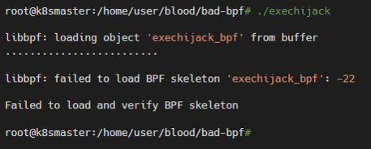
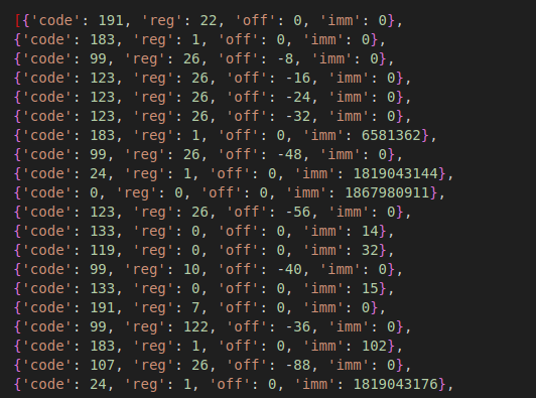
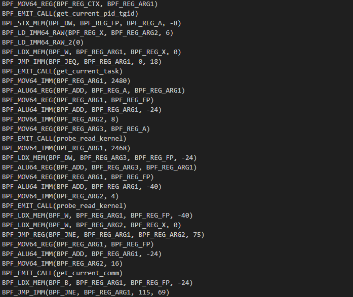
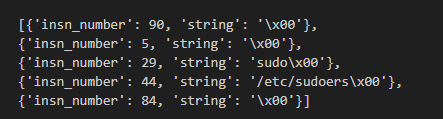

# 4RAYS eBPF Sentry

The Proof-of-Concept tool demonstrates some insights into detection and prevention based on eBPF programs' instructions and metadata. This tool also extracts available strings and translates eBPF instructions to human-readable format according to Linux kernel headers.\
Full article can be found [here](https://rt-solar.ru/solar-4rays/blog/4918/).


## Key concepts

There are some key aspects of our Proof-of-Concept:
1. We're using kprobe on [bpf()](https://man7.org/linux/man-pages/man2/bpf.2.html) syscall to catch eBPF program's loading step;
2. Our eBPF program extracts some metadata (prog_name, loader's name, etc), iterates through catched instructions (insns), parses used [bpf-helpers](https://man7.org/linux/man-pages/man7/bpf-helpers.7.html);
3. It's possible to make some detects based on previously extracted data (used **bpf-helpers**, **prog_name**);
4. Prevention is based on eBPF program corruption: we're placing **BPF_EXIT_INSN()** as the first instruction of a suspected eBPF program;
5. After kernel mode's work is done, we're using instructions to re-create catched eBPF program in a friendy (more human-readable) format in user mode;
6. Human-readable format includes parsed instructions, parsed strings from eBPF-program and used **bpf-helpers**;
7. Everything above can be used as a telemetry for external systems like SIEM to make some detections.


## [Few words about detection patterns in kernel mode](#patterns)

All detection patterns should be placed in `ebpfcodegenerator.py`:
```python
    funclimitpatterns = {}
    prognamepatterns = []
    if detectname == "pamspy":
        funclimitpatterns = {
        14: 1, #bpf_get_current_pid_tgid
        1: 1, #bpf_map_lookup_elem
        4: 5, #bpf_probe_read
        3: 1, #bpf_map_delete_elem
        16: 1, #bpf_get_current_comm
        132: 1, #bpf_ringbuf_submit
        131: 1, #bpf_ringbuf_reserve
        }
        prognamepatterns = ["testtest", "handle_", "det_"]
    elif detectname == "exechijack":
        funclimitpatterns = {
        14: 1, #bpf_get_current_pid_tgid
        35: 1, #bpf_get_current_task
        113: 2, #bpf_probe_read_kernel
        112: 2, #bpf_probe_read_user
        6: 2, #bpf_trace_printk
        36: 1, #bpf_probe_write_user
        131: 1, #bpf_ringbuf_reserve
        132: 1, #bpf_ringbuf_submit
        }
        prognamepatterns = ["handle_execve_enter1"]
    else:
        print("dontknow")
```
		
Patterns contain **bpf-helpers** (the bpf-helper number from mapping and the number of uses in eBPF program that we're trying to detect) and eBPF program name (**prog_name**). The **Bpf-helpers** mapping can be found in the Linux kernel header [bpf.h](https://github.com/torvalds/linux/blob/master/include/uapi/linux/bpf.h#L5799). \
\
The pattern could be selected in `bpf_kprobe_handler.py`:
```python
bpf_prog_txt = generatecode("pamspy")
```
or
```python
bpf_prog_txt = generatecode("exechijack")
```
If a suspected eBPF-program matches the selected pattern, it will be stopped from loading. 
Example patterns are made for [pamspy](https://github.com/citronneur/pamspy) and [exechijack](https://github.com/pathtofile/bad-bpf/blob/main/src/exechijack.bpf.c). Feel free to write and try your own patterns. 

From the standpoint of the eBPF program that is being loaded, corruption looks like this:




## About user mode parser

The user mode parser gets instructions and an eBPF program's metadata from kernel mode and makes some parsing according to Linux Kernel headers. The parser can be found in `insns_parser.py`.\
Parser uses instruction's prototypes and constants/enums from [bpf_common.h](https://github.com/torvalds/linux/blob/master/include/uapi/linux/bpf_common.h) and [filter.h](https://github.com/torvalds/linux/blob/master/include/linux/filter.h).

Instructions before parsing look like this:



And after parsing:



Also, the parser extracts available strings (`insns_enricher.py`):




## How to use

1. Install [BCC](https://github.com/iovisor/bcc/blob/master/INSTALL.md);
2. Clone this repository:
```bash
$ git clone https://github.com/4RAYS-by-SOLAR/ebpf-sentry.git
```
3. Change or create your own detection patterns in `ebpfcodegenerator.py` and select [pattern](#patterns) in `bpf_kprobe_handler.py`;
4. Run `bpf_kprobe_handler.py` as root:
```bash
$ sudo python3 bpf_kprobe_handler.py
```
5. Run eBPF tool you're trying to detect with patterns;
6. Enjoy!


